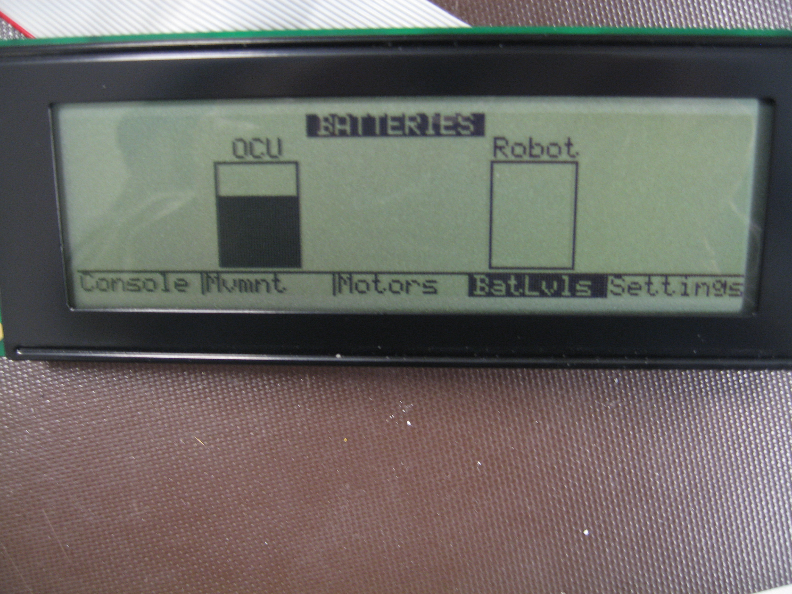
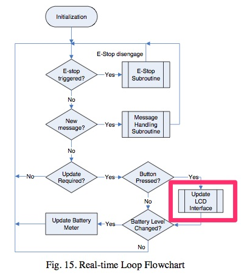
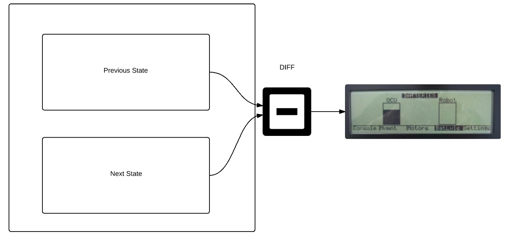
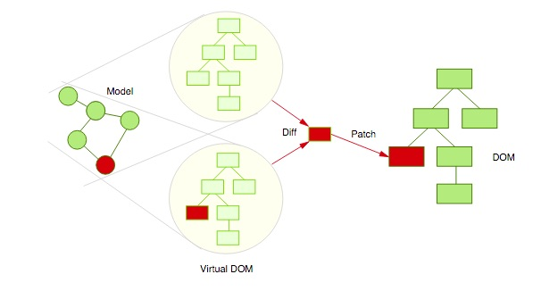

# What is a Virtual DOM?
#### @benzittlau
#### http://getjobber.com
#### http://benzittlau.com
#### http://springlaunched.com
#### http://zittlau.ca
#### http://github.com/benzittlau


## Not related to Shadow DOM
Shadow DOM is a feature currently only supported by Chrome and Opera to create an encapsulated "Shadow Tree" within a document.

Useful for isolating the styling and scripting of a web component from it's surrounding document, isolating the semantics.

Not related to Virtual DOM.


## Bitmap Display



## Hantronix HDM64GS24L 240x64 display
Each frame required writing to a memory buffer on the display driver chip.


## Real Time Loop
Software was single threaded, so the render occurred in the main loop of the application.

Writing updates for all 15360 pixels each frame was slowing down the overall system real time loop.

Long render times could cause things like delays to signals to tell the motors to stop driving.




## BitMap Diff
Maintaining a buffered version of the display memory in MCU memory allowed us to only write changes to the display driver.




## Virtual DOM
The name of the engine in React used for making drawing the UI more efficient

Also the name of the general idea of tracking a "Virtual" DOM in memory for performance enhancement.


## Expressing State through UI
In modern web applications we often allow client side *state* to be modified without a page load.  This could be something as simple as a new chat message, or something as complex as changing to a new route within an application.

The primary tool we have to express state through an User Interface is the DOM (Document Object Model). (There are others like SVG or Canvas)

HTML and the DOM were not intended to support dynamic interfaces, changes to the DOM are often slow to redraw.


## Reflows and Repaints
Anything that changes the DOM or it's styling can trigger a Reflow, or a Repaint.

Reflows are generally more expensive than Repaints, as they require performing the layout for the entire DOM.  Reflows will be triggered by anything that can affect the structure of the page (changing page content, font size, dimensions, adding or removing an element).

Repaints are generally less expensive, but are still *expensive*.  Repaints are triggered when anything stylistic changes (background color, text color, etc.)


## Reflows and Repaints - Examples
### Repaint - Color change


[Codepen](http://codepen.io/benzittlau/pen/obPOYZ)

### Redraw - Layout change


[Codepen](http://codepen.io/benzittlau/pen/VeGNvp)


## Things the browser does
As the DOM is a tree changes higher up the tree invalidate more branches, requiring a more expensive Reflow.

Browsers will also try and batch changes themselves, but actions by the user can force them to reflow more aggressively (for example fetching the `offsetLeft` property of an element)


## DEMO!
Let's look at the degraded performance of a fairly simple example

[Basic game grid](http://codepen.io/benzittlau/pen/jWpBxb/)


## Some Ideas To Improve Things
In trying to improve the rendering performance of an HTML5 application there are a few key ideas:

* Dirty Flagging

* Virtual DOM Diffing

* Update batching


## Dirty Flagging
Dirty flagging is used to identify what has and *hasn't* changed, so we can focus on only certain areas (components, templates, subtrees) to re-render.

In Ember this is handled through bindings, observers, and computed property's.

In React this typically a more manual process owned by the user (`shouldComponentUpdate`), unless implementing immutable data structures.


## Virtual DOM Diffing
Once it is determined which areas of the tree might have mutated the Virtual DOM comes into play

It's job is to compare the previous and next state of it's own in-memory respresentation of the DOM to determine where changes have occurred

Deterministicly calculating the ideal most efficient path to mutate the tree is possible but far to expensive.

Instead it applies a series of heuristics to determine the most efficient way to mutate the DOM from the previous, to next, state


### Virtual DOM Diffing - Examples
Simple case:
```
renderA: <div><span>first</span></div>
renderB: <div><span>first</span><span>second</span></div>
=> [insertNode <span>second</span>]
```

Edge case:
```
renderA: <div><span>first</span></div>
renderB: <div><span>second</span><span>first</span></div>
=> [replaceAttribute textContent 'second'], [insertNode <span>first</span>]
```

[Source](https://facebook.github.io/react/docs/reconciliation.html)


### Virtual DOM Diffing - Model



## Ember (and Glimmer)
Ember uses an engine called "Glimmer" to manage it's in-memory representation of the DOM

It's strategy is different.

Uses bindings to have a handle to directly where it needs to mutate it's virtual DOM to avoid full renders.

Leverages htmlbars to differentiate between static and dynamic components, to avoid checking static components for changes.

Stores it's virtual DOM representation as lightweight "stream-like objects" instead of full objects.


## The DOM Model
DOM trees have one node for each tag and one node for the text between nodes.


## Update Batching
Ensure that there is at most one layout performed each time you update the state of the page.


## Using a "loop" strategy
A common strategy is to use an event "loop", where during one iteration of the loop all changes are batched, and "flushed" once per loop.

In Ember this ensures that a change to a property and all it's related properties downstream will only trigger a single update.


## Using the request animation frame
A common strategy is to use an event "loop", where during one iteration of the loop all changes are batched, and "flushed" once per loop.

In Ember this ensures that a change to a property and all it's related properties downstream will only trigger a single update.

## Write only algorithms


## Custom Event Systems


## Surprises
This technology is still very immature and evolving.

Differences in the structures of Ember and React have taken them down very different paths towards addressing similar problems.

What we think of as "Virtual DOM" is a combination of different technologies acting in coordination with each other.  Understanding how your components and data models affect rendering performance will help you write better application structures from the start.
